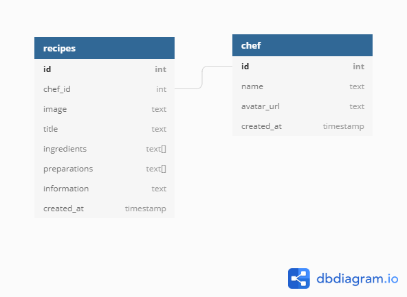

<h1 align="center">
    
</h1>

<h2 align="center">
    Fabiano Luizon Campos
</h2>

<h3 align="center">
    Software Developer
</h3>

---

https://github.com/FabianoLuizonCampos/lauchbase-5-0-foodfy-admin-dataInSql.git

---

## 👾 About
`Foodfy Admin`  - Food site, this new step get all data in PostgreSQL DataBase. Data´s persitence. That´s a challenge from Rocketseat's Lauchbase Bootcamp !!!

## 🖥️ Screenshots

<h1 align="center">
    
</h1>

## Setup for Web Site

1. First clone de repository - If you need help acess: https://help.github.com/pt/github/creating-cloning-and-archiving-repositories/cloning-a-repository
2. Open your computer´s terminal and change to folder that was cloned
3. You already have NodeJs installed in you computer;
4. Install in terminal with line commands  
5. `npm install` 
6. `npm start`
6. In browser go to url: `localhost:5000`


## Setup for Database

1. Install PostgreSQL Database
2. Run follow query:

```sql

CREATE DATABASE foodfy;

```
3. Make connection with this database and run follow querys:

```sql

CREATE TABLE "recipes" (
  "id" SERIAL PRIMARY KEY,
  "chef_id" int NOT NULL,
  "image" text,
  "title" text,
  "ingredients" text[],
  "preparations" text[],
  "information" text,
  "created_at" timestamp NOT NULL
);

CREATE TABLE "chef" (
  "id" SERIAL PRIMARY KEY,
  "name" text,
  "avatar_url" text,
  "created_at" timestamp NOT NULL
);

ALTER TABLE "recipes" ADD FOREIGN KEY ("chef_id") REFERENCES "chef" ("id");

```

4. In website connect to above url´s to start put data in database:

- http://localhost:5000/admin/recipes
- http://localhost:3001/admin/chefs

5. Database Diagram using dbdiagram.io

<h1 align="center">
    
</h1>


## ✔️ Technologies Used
- HTML
- CSS
- JavaScript 
- Node / Express
- Nunjucks - Template Engine
- PostgreSQL Database

## 📇 Contacts
- <a href="https://github.com/FabianoLuizonCampos" target="_blank">Github</a>
- <a href="https://www.linkedin.com/in/fabianoluizoncampos" target="_blank">LinkedIn</a>
- <a href="mailto:fabianoluizoncampos@gmail.com" target="_blank">Email</a>
